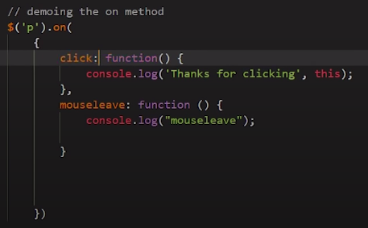
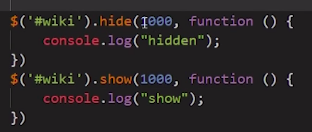
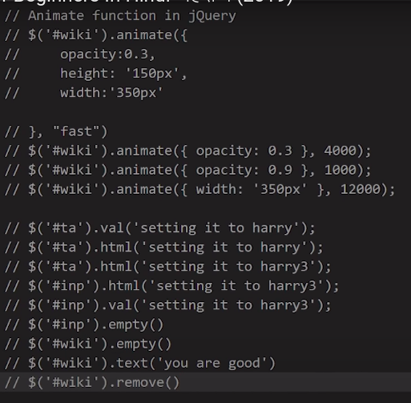
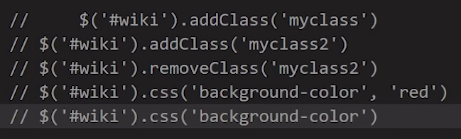
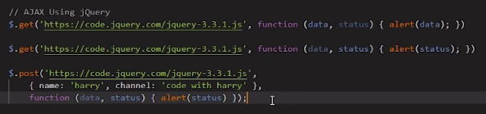

```javascript
$('button').click() // clicks on button
- $('button').click(function(){
    // Does something when clicked
    $(this).hide()
}) 
```
# Starting
```javascript
$(document).ready(function(){
    // Do everything here.
})

// This is identical
$(function(){
    // Do everything here.
})
```

# Selecting
```javascript
$("*") // Selects all elements.
```

# Events
- hover can take two functions as argument. One for hover in, other for hover out.
### Attach multiple event handlers
  

# Actions
### hide and show
- hide and show can take two arguments: time_in_milliseconds, callback_function.
  
- toggle
- fadeIn, fadeOut
- fadeTo
- fadeToggle

  

  
- toggleClass

# Ajax
- Art of transferring data without interfering user experience.
  


# Display image when loaded
```javascript
    var img = new Image(),
        x = document.getElementById("image");
    console.log(x);
    img.onload = function () {
        x.src = img.src;
    };

    img.src = "https://wallpaperaccess.com/download/hd-30100"
})
```

